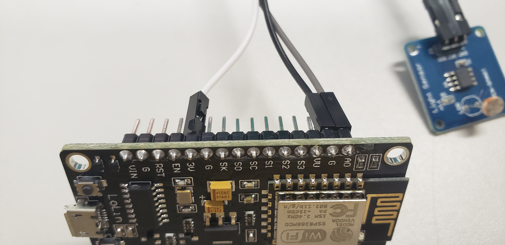
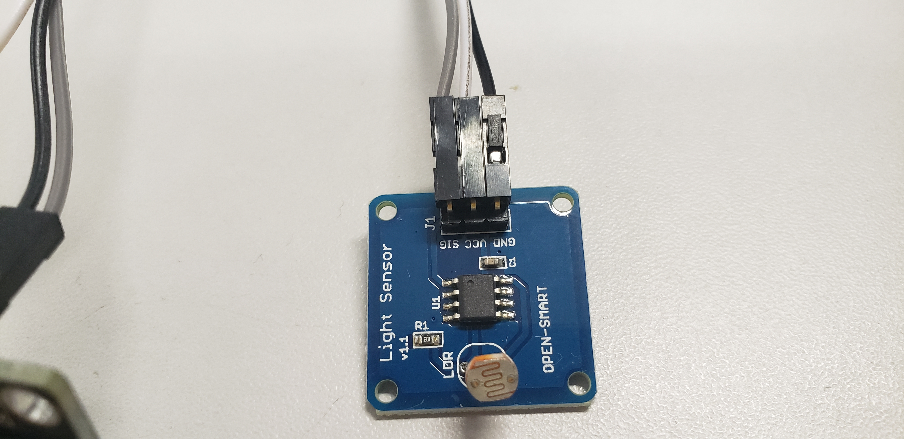

# Projeto 4 - Utilização do NODEMCU+sensores em substituição dos sensores do celular
### Passo 0 - Preparar o Ambiente Arduino - IDE
Adicionar em preferencias->URL adicionais para gerenciamento de placas : http://arduino.esp8266.com/versions/2.5.0/package_esp8266com_index.json

Link com tutorial para instalar a placa ESP e programas iniciais para a placa
https://www.filipeflop.com/blog/programar-nodemcu-com-ide-arduino/


### Passo 1 - Executar Blink no NODEMCU ESP 
```C++
void setup() {
// Define o pino 2 como saida
pinMode(2, OUTPUT);
}
void loop() {
digitalWrite(2, HIGH); // Acende o Led
delay(3000); // Aguarda 3 segundo
digitalWrite(2, LOW); // Apaga o Led
delay(3000); // Aguarda 3 segundo
}
```

### Passo 2 - Montar Circuito com NODEMCU e sensor de luminosidade(LDR)

 
 
 
 
 
 

### Passo 3 - Código que captura dados do sensor e envia para o thingspeak

```c++
#include <ESP8266WiFi.h>
#include <WiFiClient.h> 
#include <ESP8266WebServer.h>
#include <ESP8266HTTPClient.h>
 
/* Configuração das credenciais - rede */
const char *ssid = "suarede";  //Entre com as configurações da sua wifi
const char *password = "suasenha";
 

const char *host = "https://api.thingspeak.com";   //site ou ip
 
//=======================================================================
//                    Power on setup
//=======================================================================
 
void setup() {
  delay(1000);
  Serial.begin(9600);
  WiFi.mode(WIFI_OFF);        //Prevents reconnection issue (taking too long to connect)
  delay(1000);
  WiFi.mode(WIFI_STA);        //This line hides the viewing of ESP as wifi hotspot
  
  WiFi.begin(ssid, password);     //Connect to your WiFi router
  Serial.println("");
 
  Serial.print("Connecting");
  // Wait for connection
  while (WiFi.status() != WL_CONNECTED) {
    delay(500);
    Serial.print(".");
  }
 
  //If connection successful show IP address in serial monitor
  Serial.println("");
  Serial.print("Connected to ");
  Serial.println(ssid);
  Serial.print("IP address: ");
  Serial.println(WiFi.localIP());  //IP address assigned to your ESP
}
 
//=======================================================================
//                    Main Program Loop
//=======================================================================
void loop() {
  HTTPClient http;    //Declare object of class HTTPClient
 
  String ADCData, station, getData, Link;
  int adcvalue=analogRead(0);  //Read Analog value of LDR
  ADCData = String(adcvalue);   //String to interger conversion
  station = "B";
 
  //GET Data
  //GET https://api.thingspeak.com/update?api_key=540QGLZMYPB8U2M4&field1=0
  getData = "?api_key=540QGLZMYPB8U2M4&field1=" + ADCData; 
  Link = "http://api.thingspeak.com/update" + getData;
  
  http.begin(Link);     //Specify request destination
  Serial.println(Link); 
  int httpCode = http.GET();            //Send the request
  String payload = http.getString();    //Get the response payload
 
  Serial.println(httpCode);   //Print HTTP return code
  Serial.println(payload);    //Print request response payload
 
  http.end();  //Close connection
  
  delay(5000);  //GET Data at every 5 seconds
}
```
